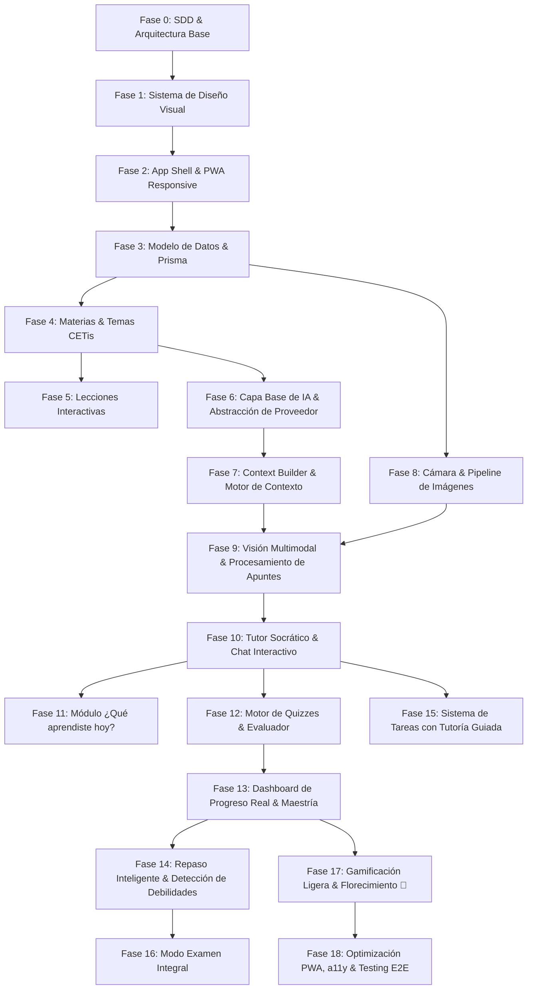

# Roadmap del Proyecto MAR (Revisado)
### *Spec-Driven Development Roadmap*

> **Convenciones de Estado:**  
> ⏳ `PENDIENTE` — Fase planificada aún no iniciada  
> 🔄 `EN PROGRESO` — Fase activa con spec aprobada o en revisión  
> ✅ `COMPLETADA` — Fase implementada, validada y documentada  

---

## Estado General del Proyecto

- **Fase Actual:** `Fase 0 — Inventario, SDD Inicial y Arquitectura Base`
- **Progreso Global:** Especificación técnica y definición de capas en revisión.

---

## Fases de Implementación y Dependencias Técnicas

---

### Fase 0: Inventario, SDD Inicial y Arquitectura Base 🔄
- [x] Inventario completo del workspace e identificación de requerimientos.
- [x] Elaboración de `docs/sdd/mission.md`.
- [x] Elaboración de `docs/sdd/tech-stack.md` con definición detallada de fronteras, taxonomía y contexto.
- [x] Elaboración de `docs/sdd/roadmap.md`.
- [x] Creación de `AGENTS.md` con reglas universales del proyecto.
- [ ] Aprobación de la arquitectura revisada por el usuario.

---

### Fase 1: Sistema de Diseño Visual MAR (Design Tokens & UI Kit) ⏳
*Objetivo: Construir la base estética femenina, cálida, minimalista y moderna de MAR.*
- [ ] Definición de tokens de color CSS (rosa pastel, crema, blanco, acentos, contraste accesible).
- [ ] Configuración tipográfica (Google Fonts modernas y legibles en móviles).
- [ ] Utilidades de glassmorphism sutil (`backdrop-filter`, bordes traslúcidos, sombras difusas).
- [ ] Componentes base de UI (Botones con microinteracciones, Cards suaves, Badges, Inputs, Modales).
- [ ] Componente visual y animación distintiva 🌸 (Lirios / pétalos para celebraciones de logros).

---

### Fase 2: Shell de Aplicación & Navegación Responsive PWA ⏳
*Objetivo: Estructura de layout fluida y experiencia tipo app nativa en smartphones y escritorio.*
- [ ] Configuración del proyecto base (React + Vite + TypeScript + PWA Manifest).
- [ ] Navegación Mobile-First (Bottom Bar fija e intuitiva para móviles).
- [ ] Header responsivo con saludo personalizado ("Hola, Mar 🩷") y selector contextual.
- [ ] Adaptación a Sidebar / Layout expandido para tablets y pantallas de escritorio (vertical y horizontal).
- [ ] Pantalla de Inicio ("¿Qué quieres aprender hoy?") con accesos directos a las áreas principales.

---

### Fase 3: Modelo de Datos & Capa de Persistencia Académica (Prisma) ⏳
*Objetivo: Estructurar la base de datos relacional y entidades sin contenido hardcodeado.*
- [ ] Definición del schema Prisma (Student, Subject, Unit, Topic, Lesson, Note, NoteImage, Task, Quiz, QuizAttempt, Answer, Mastery, ReviewRecommendation, AIConversation, AIMessage).
- [ ] Configuración de base de datos local (SQLite para desarrollo ágil / PostgreSQL para producción).
- [ ] Seeders con las 8 materias oficiales del 3er semestre de Recursos Humanos (CETis 164).
- [ ] Repositorios y servicios backend tipados para gestión académica.

---

### Fase 4: Módulo de Exploración de Materias y Temas ⏳
*Objetivo: Visualización clara del currículo escolar y contenido temático.*
- [ ] Vistas de catálogo de materias con iconografía temática y colores distintivos.
- [ ] Desglose por unidades y temas (con el tema activo "Sinergia" en Ciencias Naturales).
- [ ] Diferenciación explícita en UI: **Contenido de Clase** vs. **Contenido Complementario**.

---

### Fase 5: Sistema de Lecciones & Visualizador de Contenido ⏳
*Objetivo: Experiencia de estudio interactiva con explicaciones, analogías y ejemplos.*
- [ ] Visualizador de lección estructurada (Conceptos clave, explicaciones sencillas, ejemplos cotidianos).
- [ ] Integración de botón contextual de acceso rápido: *"¿No entendiste algo? Preguntar a Mar IA"*.
- [ ] Control de estado de lectura y tiempo de estudio por tema.

---

### Fase 6: Capa Base de IA & Abstracción de Proveedor (`IAITutorProvider`) ⏳
*Objetivo: Núcleo de inteligencia artificial desacoplado, seguro y altamente tipado.*
- [ ] Interface abstracta `IAITutorProvider` para desacoplar modelos (Gemini, OpenAI, Anthropic).
- [ ] Adaptador para proveedor propuesto inicial (Google Gemini vía `@google/genai`).
- [ ] Esquemas de salida estructurada Zod / JSON Schema para extracción de conceptos y respuestas pedagógicas.
- [ ] Manejo de rate limits, reintentos automáticos (exponential backoff) y políticas de seguridad/anti-alucinación.

---

### Fase 7: Context Builder & Motor de Contexto ⏳
*Objetivo: Ensamblaje seguro y optimizado de `AIContextPayload` sin sobrecargar tokens.*
- [ ] Módulo `ContextBuilder` con filtrado de información estrictamente necesaria.
- [ ] Inyección de conceptos débiles, nivel de maestría y apuntes activos.
- [ ] Aislamiento de datos sensibles y cumplimiento de políticas de privacidad.

---

### Fase 8: Módulo de Cámara & Pipeline de Imágenes (Image Pipeline) ⏳
*Objetivo: Captura y gestión optimizada de fotos de cuadernos y apuntes físicos de Mar.*
- [ ] Interfaz de captura de fotografía nativa / selector de galería optimizado para móviles.
- [ ] Pipeline backend con `Multer` y `Sharp` (redimensionamiento a max 2048px, compresión WebP al 85%, validación MIME).
- [ ] Visor de apuntes con zoom, fecha de clase y metadatos asociados.

---

### Fase 9: Visión Multimodal & Procesamiento de Apuntes con IA ⏳
*Objetivo: Transformar fotos de clase en temas, conceptos y preguntas de estudio.*
- [ ] Pipeline de visión multimodal para transcribir y estructurar contenido manuscrito de cuadernos.
- [ ] Protocolo para casos límite (imágenes borrosas, materias dudosas, múltiples materias).
- [ ] Algoritmo de sugerencia de Materia/Tema con confirmación explícita de Mar (`AI_INFERENCE` → `CLASS_ORIGIN`).

---

### Fase 10: Tutor Socrático & Chat Interactivo ⏳
*Objetivo: Tutor pedagógico con memoria contextual y enfoque socrático paso a paso.*
- [ ] Chat de estudio con opciones rápidas de pedagogía (*"Explícamelo más fácil"*, *"Dame un ejemplo"*, *"Ponme un ejercicio"*).
- [ ] Invocación contextual desde lecciones, quizzes y apuntes (*"Explícame por qué fallé"*).
- [ ] Persistencia de sesiones y descarte de datos efímeros.

---

### Fase 11: Módulo "¿Qué aprendiste hoy?" ⏳
*Objetivo: Síntesis diaria de clase guiada por IA a partir de texto o notas rápidas.*
- [ ] Formulario conversacional simple para escribir lo visto en el día.
- [ ] Transformación automática en resumen estructurado, conceptos clave y mini-quiz de comprobación.
- [ ] Guardado automático en el historial de sesiones de la materia correspondiente.

---

### Fase 12: Motor de Quizzes Educativos & Evaluador ⏳
*Objetivo: Validación práctica de conocimientos con quizzes de 5 a 10 preguntas.*
- [ ] Componente interactivo de Quiz (preguntas de opción múltiple, verdadero/falso, relación de conceptos).
- [ ] Generación dinámica de reactivos con IA basados en el apunte o tema actual.
- [ ] Temporizador sutil no estresante y selector de respuestas con feedback háptico/visual.
- [ ] Microinteracción de florecimiento de lirio 🌸 al obtener resultados positivos.

---

### Fase 13: Dashboard de Progreso Real & Nivel de Maestría ⏳
*Objetivo: Dashboard pedagógico sin métricas artificiales.*
- [ ] Pantalla de desglose post-quiz con explicación de cada error.
- [ ] Dashboard de progreso (dominio porcentual por materia y tema, temas fuertes vs. temas a reforzar).
- [ ] Registro histórico de sesiones de estudio y evolución en el tiempo.

---

### Fase 14: Repaso Inteligente & Detección de Conceptos Débiles ⏳
*Objetivo: Refuerzo automático de temas con menor porcentaje de dominio.*
- [ ] Algoritmo de detección de debilidades conceptuales basado en historial de quizzes.
- [ ] Generador de micro-sesiones de repaso dirigidas específicamente a los errores detectados.
- [ ] Sección en dashboard: *"Temas recomendados para repasar hoy"*.

---

### Fase 15: Sistema de Tareas Académicas con Tutoría Guiada ⏳
*Objetivo: Planificación de entregas y resolución guiada socrática paso a paso.*
- [ ] CRUD de tareas (Materia, título, fecha de entrega, prioridad, estado y fotos adjuntas).
- [ ] Asistente de tareas con IA en modo socrático (brinda pistas y explica conceptos sin dar la solución directa).
- [ ] Notificaciones y recordatorios visuales de fechas límite próximas.

---

### Fase 16: Modo Examen (Simulacro Integral) ⏳
*Objetivo: Preparación para evaluaciones parciales y exámenes del CETis.*
- [ ] Selector de materia, múltiples temas, volumen de preguntas (10 a 30) y límite de tiempo.
- [ ] Experiencia inmersiva de simulacro de examen con retroalimentación completa al finalizar.
- [ ] Reporte diagnóstico post-examen con plan de estudio remedial sugerido por IA.

---

### Fase 17: Gamificación Ligera & Hitos de Florecimiento ⏳
*Objetivo: Motivación intrínseca y refuerzo positivo sin estrés.*
- [ ] Sistema de insignias educativas (Primera sesión, Constancia semanal, Dominio de tema, 90%+).
- [ ] Animaciones y mensajes cálidos de apoyo personalizados para Mar.

---

### Fase 18: Optimización PWA, Accesibilidad & Testing E2E ⏳
*Objetivo: Excelencia operativa, velocidad de carga y estabilidad.*
- [ ] Auditoría de accesibilidad (a11y) y contraste de color.
- [ ] Optimización de Core Web Vitals (LCP, FID/INP, CLS) y funcionamiento offline de la PWA.
- [ ] Suite completa de tests unitarios, de integración y validación de endpoints de IA.
