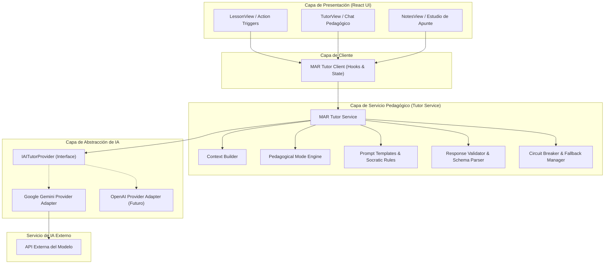
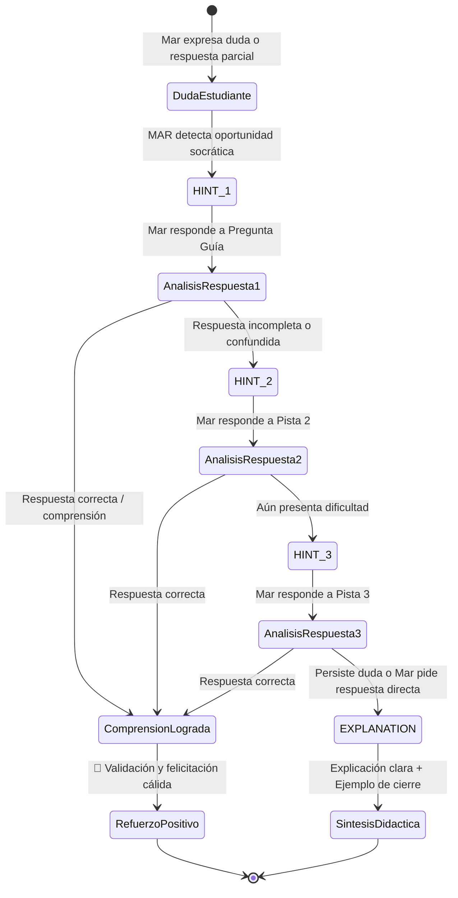

# Requisitos y Especificaciones Técnicas — MAR IA y Tutor Socrático

---

## 1. Propósito y Principio Central

El motor de inteligencia artificial de **MAR** no es un chatbot genérico de preguntas y respuestas. MAR es un **agente educativo socrático y contextual**, diseñado para acompañar activamente el aprendizaje de una estudiante de preparatoria técnica (CETis 164), anclándose en sus apuntes de clase, su currículo escolar y sus propias reflexiones.

```text
               ┌─────────────────────────────────────────────────────────┐
               │                  PRINCIPIO ARQUITECTÓNICO               │
               │                                                         │
               │  "MAR no responde como un buscador ni como un bot.     │
               │   MAR guía el razonamiento de Mar utilizando el         │
               │   contexto real de sus clases y materiales de estudio." │
               └─────────────────────────────────────────────────────────┘
```

### Directrices Fundamentales:
1. **La Conversación es solo una Interfaz:** La IA asiste en lecciones interactivas, síntesis de clase, explicaciones paso a paso, ejercicios y repaso conceptual. El chat libre es una modalidad más, no el centro del sistema.
2. **Desacoplamiento Absoluto del Proveedor:** El dominio educativo nunca importa ni depende directamente de SDKs propietarios (`@google/genai`, `openai`, `@anthropic-ai/sdk`). Toda interacción pasa por la abstracción `IAITutorProvider`.
3. **Cero Alucinaciones Académicas:** La IA nunca inventa contenido de apuntes, fechas de entrega, tareas o instrucciones que no estén documentadas en el contexto.
4. **Pedagogía Socrática Prioritaria:** Guiar paso a paso mediante preguntas reflexivas y pistas progresivas antes de dar la respuesta directa.

---

## 2. Arquitectura de Capas de MAR IA



---

## 3. Contratos Principales

### 3.1. Abstracción del Proveedor (`IAITutorProvider`)

La interfaz `IAITutorProvider` abstrae el modelo de lenguaje de cualquier tecnología subyacente.

```ts
/**
 * Opciones de ejecución para la llamada al proveedor de IA
 */
export interface AIGenerationOptions {
  timeoutMs?: number;
  temperature?: number;
  maxOutputTokens?: number;
  abortSignal?: AbortSignal;
}

/**
 * Metadata devuelta por el proveedor de IA para trazabilidad y métricas
 */
export interface AIExecutionMetadata {
  providerName: string;         // 'google-gemini' | 'openai' | 'anthropic' | 'mock'
  modelIdentifier: string;      // 'gemini-1.5-flash' | 'gpt-4o-mini' | etc.
  promptTokens?: number;
  completionTokens?: number;
  totalTokens?: number;
  executionDurationMs: number;
  timestamp: string;
}

/**
 * Resultado crudo estandarizado del proveedor
 */
export interface AIProviderResult {
  rawText: string;
  structuredData?: unknown;     // JSON parseado si se requirió structured output
  metadata: AIExecutionMetadata;
}

/**
 * Interface desacoplada del Proveedor de IA
 */
export interface IAITutorProvider {
  /**
   * Nombre único del proveedor
   */
  readonly providerId: string;

  /**
   * Versión del adaptador
   */
  readonly version: string;

  /**
   * Generación estructurada de contenido pedagógico
   */
  generatePedagogicalResponse(
    payload: AIContextPayload,
    options?: AIGenerationOptions
  ): Promise<AIProviderResult>;

  /**
   * Verificación de salud y disponibilidad del servicio
   */
  checkHealth(): Promise<boolean>;
}
```

---

### 3.2. Contrato de Contexto Educativo (`AIContextPayload`)

`AIContextPayload` define de manera estricta y mínima la información académica y del estudiante que viaja a la IA.

```ts
import { ProvenanceOrigin } from './provenance';

/**
 * Modos pedagógicos disponibles
 */
export type PedagogicalMode =
  | 'EXPLAIN'     // Explicación conceptual estándar
  | 'SIMPLIFY'    // Explicación sencilla, analogías cotidianas
  | 'EXAMPLE'     // Ejemplos prácticos contextualizados
  | 'QUESTION'    // Pregunta de comprobación de comprensión
  | 'EXERCISE'    // Ejercicio práctico guiado
  | 'SOCRATIC'    // Diálogo mayéutico / socrático paso a paso
  | 'REVIEW';     // Repaso de conceptos clave previos

/**
 * Nivel de ayuda en interacción socrática
 */
export type SocraticHintLevel = 'HINT_1' | 'HINT_2' | 'HINT_3' | 'EXPLANATION';

/**
 * Referencia contextual de un apunte físico
 */
export interface ContextualNoteSnippet {
  noteId: string;
  title: string;
  subjectName?: string;
  topicName?: string;
  textExtract?: string;        // Transcripción o notas de texto
  provenance: ProvenanceOrigin;
  hasImage: boolean;
  imageMimeType?: string;
}

/**
 * Mensaje individual del historial de conversación relevante
 */
export interface RelevantConversationTurn {
  role: 'student' | 'tutor';
  text: string;
  timestamp: string;
  pedagogicalMode?: PedagogicalMode;
}

/**
 * Contrato formal de carga de contexto para MAR IA
 */
export interface AIContextPayload {
  // 1. Identificación y Modo
  sessionId: string;
  pedagogicalMode: PedagogicalMode;
  socraticHintLevel?: SocraticHintLevel;
  studentIntent: string;

  // 2. Contexto Académico Curricular (CETis 164)
  academicContext: {
    subjectId?: string;
    subjectName?: string;
    topicId?: string;
    topicName?: string;
    unitNumber?: number;
    currentLessonStepTitle?: string;
    keyConcepts?: string[];
  };

  // 3. Material de Clase y Apuntes Seleccionados (CLASS_ORIGIN / USER_PROVIDED)
  notesContext?: {
    relevantNotes: ContextualNoteSnippet[];
    activeNoteId?: string;
  };

  // 4. Aportaciones y Reflexiones del Estudiante (USER_PROVIDED)
  studentInput: {
    latestUtterance: string;
    studentReflection?: string;
    confidenceSelfReport?: 'high' | 'medium' | 'low';
  };

  // 5. Historial Conversacional Reciente (Ventana Deslizante)
  conversationHistory: RelevantConversationTurn[];

  // 6. Restricciones Epistemológicas de la Sesión
  constraints: {
    maxTokens: number;
    requireSocraticStep: boolean;
    allowComplementaryExpansion: boolean;
  };
}
```

---

### 3.3. Contrato de Respuesta Estructurada (`AITutorResponse`)

MAR IA nunca devuelve texto plano sin estructura. Las respuestas se empaquetan en un objeto fuertemente tipado para que la UI pueda representarlas visualmente de manera rica, accesible y no frágil.

```ts
/**
 * Sugerencia interactiva de acción rápida para la estudiante
 */
export interface SuggestedAction {
  id: string;
  label: string;               // Ej: "Explícamelo con un ejemplo", "Ponme un ejercicio"
  mode: PedagogicalMode;
  payload?: string;
}

/**
 * Componente socrático de la respuesta
 */
export interface SocraticStep {
  currentLevel: SocraticHintLevel;
  guidingQuestion: string;     // Pregunta para hacer pensar a Mar
  clue?: string;               // Pista sutil sin dar la solución
  expectedConceptFocus: string;// Qué concepto busca que Mar identifique
}

/**
 * Respuesta estructurada final de MAR IA
 */
export interface AITutorResponse {
  id: string;
  sessionId: string;
  timestamp: string;
  
  // Mensaje principal pedagógico formateado en Markdown accesible
  message: string;

  // Modo pedagógico ejecutado
  mode: PedagogicalMode;

  // Metadata de procedencia del conocimiento emitido
  provenance: ProvenanceOrigin; // Generalmente AI_COMPLEMENTARY o AI_INFERENCE

  // Paso socrático si el modo es SOCRATIC
  socraticStep?: SocraticStep;

  // Pregunta de comprobación de comprensión (opcional)
  comprehensionCheck?: {
    questionText: string;
    suggestedOptions?: string[];
  };

  // Ejercicio práctico (opcional)
  exercise?: {
    title: string;
    instructions: string;
    hints: string[];
  };

  // Acciones rápidas sugeridas para continuar la sesión
  suggestedActions: SuggestedAction[];

  // Indicador de incertidumbre (si la IA requiere que Mar confirme algo)
  requiresConfirmation?: boolean;
  confirmationPrompt?: string;

  // Trazabilidad
  executionMetadata: AIExecutionMetadata;
}
```

---

## 4. Clasificación Rigurosa de Provenance

El sistema utiliza exclusivamente las cuatro categorías oficiales de procedencia:

| Procedencia | Significado y Tratamiento Pedagógico | Indicador Visual |
|---|---|:---:|
| `CLASS_ORIGIN` | **Material de clase confirmado por Mar** (fotos de cuaderno, pizarrón, dictados, explicaciones de profesores). Tratamiento: Base de verdad prioritaria del curso; MAR asume que este es el lenguaje y criterio de evaluación de sus maestros en el CETis 164. | 📌 Apunte de clase |
| `USER_PROVIDED` | **Aportaciones de Mar** (reflexiones personales en lecciones, notas escritas, dudas, respuestas a preguntas socráticas). Tratamiento: Base para medir el nivel de comprensión actual de la estudiante. | ✍️ Tu nota |
| `AI_INFERENCE` | **Inferencias o hipótesis pedagógicas de MAR** (sugerencias de materia para un apunte, detección de posibles confusiones conceptuales). Tratamiento: Siempre tentativas; **nunca se dan por hechas** y requieren confirmación de Mar. | 🔍 Sugerencia por confirmar |
| `AI_COMPLEMENTARY` | **Explicaciones, analogías, pistas y ejercicios generados por la IA** para enriquecer el aprendizaje. Tratamiento: Complemento didáctico que apoya, pero no sustituye, las notas de clase. | ✨ Explicación de MAR |

---

## 5. Política de Privacidad y Minimización de Contexto

El `ContextBuilder` aplica un filtrado riguroso antes de construir el payload:

### ✅ Información Permitida (Whitelist):
* Nombre de la materia activa y nombre del tema actual.
* Contenido textual de la lección o paso en el que se encuentra Mar.
* Notas manuscritas seleccionadas explícitamente para la sesión de estudio.
* Últimas 3 a 5 intervenciones de la conversación actual (ventana acotada).
* La última reflexión o pregunta escrita por Mar.

### ❌ Información Estrictamente Prohibida (Blacklist):
* **Credenciales y Secretos:** API keys, variables de entorno, tokens JWT, configuraciones internas.
* **Datos de Infraestructura:** Rutas del sistema de archivos local, logs de depuración, schemas de base de datos internos.
* **Datos Fuera de Contexto:** Apuntes o materias ajenas a la sesión de estudio activa.
* **Historial Completo no Relevante:** Sesiones anteriores cerradas o mensajes antiguos fuera de la ventana deslizante.
* **Datos Personales Sensibles:** Direcciones, correos electrónicos, contraseñas o identificadores de dispositivo.

---

## 6. Motor Pedagógico y Modos de Aprendizaje

```text
┌──────────────┐     ┌──────────────┐     ┌──────────────┐
│   EXPLAIN    │     │   SIMPLIFY   │     │   EXAMPLE    │
│  Concepto    │     │  Analogía    │     │ Caso de vida │
│  estructurado│     │  cotidiana   │     │ real/práctico│
└──────┬───────┘     └──────┬───────┘     └──────┬───────┘
       │                    │                    │
       └────────────────────┼────────────────────┘
                            │
              ┌─────────────▼─────────────┐
              │      MODO SOCRÁTICO       │
              │   (HINT_1 → HINT_2 →      │
              │    HINT_3 → EXPLANATION)  │
              └─────────────┬─────────────┘
                            │
       ┌────────────────────┼────────────────────┐
       │                    │                    │
┌──────▼───────┐     ┌──────▼───────┐     ┌──────▼───────┐
│   QUESTION   │     │   EXERCISE   │     │    REVIEW    │
│ Comprobación │     │ Aplicación   │     │ Síntesis de  │
│ inmediata    │     │ guiada       │     │ cierre       │
└──────────────┘     └──────────────┘     └──────────────┘
```

### 6.1. Definición de Modos:
1. **`EXPLAIN`:** Expone el concepto con precisión académica accesible, estructurando ideas clave en párrafos cortos y viñetas.
2. **`SIMPLIFY`:** Traduce el concepto a lenguaje llano y cercano, utilizando metáforas de la vida cotidiana.
3. **`EXAMPLE`:** Presenta un caso práctico aplicado (por ejemplo, en el área de Recursos Humanos o Ciencias Naturales).
4. **`QUESTION`:** Formula una pregunta de opción reflexiva para verificar si el concepto fue asimilado.
5. **`EXERCISE`:** Propone un pequeño desafío paso a paso con retroalimentación inmediata.
6. **`SOCRATIC`:** Descompone la duda en un diálogo guiado, formulando preguntas que permitan a Mar descubrir la respuesta.
7. **`REVIEW`:** Resume los puntos esenciales vistos en la sesión y felicita el avance.

---

## 7. Protocolo Socrático y Progresión de Pistas

Para evitar que el diálogo se convierta en un ciclo infinito de preguntas o genere frustración, MAR implementa una máquina de estados con un límite de **3 niveles de pista** antes de revelar la explicación completa:



### Reglas del Flujo Socrático:
1. **Nivel 1 (`HINT_1` - Pregunta de Activación):** Conecta el problema con una experiencia previa o sentido común.
2. **Nivel 2 (`HINT_2` - Pista Focalizada):** Señala la parte clave de la definición o del apunte de clase.
3. **Nivel 3 (`HINT_3` - Pista Directa):** Ofrece un contraste binario o elimina opciones incorrectas.
4. **Resolución (`EXPLANATION`):** Si tras 3 intentos la estudiante no llega al concepto, o si escribe explícitamente *"No sé, explícamelo tú"*, MAR **entrega la explicación completa con calidez y sin juzgar**, cerrando con una analogía.

---

## 8. Política Estricta Anti-Alucinaciones

1. **Declaración Explícita de Incertidumbre:** Si Mar consulta sobre un detalle que no figura en sus apuntes ni en la lección (ej. *"¿Qué dijo el profesor que venía en el examen del viernes?"*), MAR responde con honestidad:
   > *"Ese dato específico no está en tus apuntes guardados. Te recomiendo confirmarlo directamente con tus compañeros o tu profesor."*
2. **Prohibición de Inventar Hechos:** MAR no inventará calificaciones, fechas límite, tareas asignadas, páginas de libros no cargadas ni contenido de exámenes.
3. **Frontera de Inferencia:** Cualquier deducción debe acompañarse de una frase explícita: *"Con base en tus apuntes, parece que... ¿es correcto?"*.

---

## 9. Validación de Esquema y Fallbacks Seguros

### 9.1. Validación Estricta
Toda respuesta del proveedor se somete a validación mediante esquema Zod / validador estructural en el `ResponseValidator`:
* Si el JSON devuelto es inválido o no cumple el esquema, se ejecuta un reintento automático o se activa el **Fallback Pedagógico Seguro**.

### 9.2. Catálogo de Fallbacks Didácticos:

| Escenario de Falla | Comportamiento del Sistema | Mensaje Mostrado a Mar |
|---|---|---|
| **Timeout de Red ($\gt 12\,\text{s}$)** | Cancela la petición y ofrece reintento sin perder la pregunta escrita. | *"La conexión tardó un poco más de lo habitual. ¿Quieres que lo intentemos de nuevo?"* |
| **Proveedor Caído / Error 500** | Activa modo local con tarjetas de conceptos pre-cargados de la lección. | *"En este momento el servicio de tutoría está descansando. Puedes repasar los conceptos clave de la lección mientras vuelve."* |
| **Respuesta Inválida del Modelo** | Parsea el texto disponible y extrae el mensaje de forma segura. | Muestra el contenido educativo extrayendo la explicación sin romper la interfaz. |
| **Apunte o Foto Ilegible** | No infiere contenido falso; solicita nueva captura. | *"No pude leer con claridad este apunte. Intenta tomar una foto con mejor iluminación y la hoja completa."* |

---

## 10. Resiliencia: Circuit Breaker y Reintentos

```text
Estado Inicial: CLOSED (Normal)
   ├── 1 Falla → Reintento con Exponential Backoff (1s, 2s, max 2 reintentos)
   ├── 3 Fallas Consecutivas → OPEN (Circuit Breaker Activo)
   │     └── Bloquea llamadas por 30 segundos y sirve Fallback Local
   └── Tras 30s → HALF-OPEN
         └── Prueba 1 llamada: Éxito → CLOSED | Falla → OPEN (30s más)
```

---

## 11. Arquitectura Futura de Visión y Procesamiento de Apuntes

La arquitectura contempla la futura conexión multimodal sin alterar el modelo de datos establecido en TG10:

```text
[NoteImage en IndexedDB]
        │
        ▼ (Acción explícita de Mar: "Estudiar este apunte")
[ImageStorageAdapter.getImage(storageKey)]
        │
        ▼
[Image Preprocessing: Sharp / WebP optimizado max 2048px]
        │
        ▼
[AIContextPayload.notesContext (Base64 / Blob ephemeral)]
        │
        ▼
[IAITutorProvider.generatePedagogicalResponse()]
        │
        ▼
[Extracción de Conceptos Clave & Validación]
        │
        ▼
[Presentación en UI con badge CLASS_ORIGIN / AI_INFERENCE]
```

---

## 12. Seguridad y Gestión de Credenciales

1. **Cero Secretos en el Frontend:** Las API keys (`GEMINI_API_KEY`, etc.) residirán exclusivamente en el servidor backend (o servicio edge) a través de variables de entorno `.env`.
2. **Ningún Token en LocalStorage:** El cliente React jamás almacenará credenciales de proveedores.
3. **Sanitización de Entradas:** Todas las entradas de texto de la estudiante son limpiadas y recortadas a un máximo de 2,000 caracteres para evitar inyecciones de prompts maliciosos o consumo desmedido de cuota.
4. **Logs Libres de Secretos:** Los logs del sistema nunca imprimen payloads con tokens ni datos privados.
