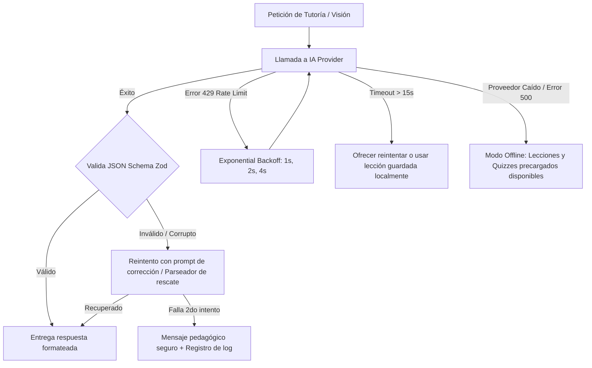

# Stack Tecnológico y Especificación Detallada de Arquitectura
### *Proyecto MAR — Plataforma Educativa Personalizada*

---

## 1. Principios de Arquitectura Técnica y Separación de Fronteras

El sistema se estructura en capas desacopladas con fronteras y contratos de responsabilidad unívocos:

```
┌─────────────────────────────────────────────────────────────────────────────┐
│ 1. MAR FRONTEND (PWA React + TypeScript)                                    │
│    - Renderizado UI, captura de fotos en cliente y gestión de estado local. │
│    - PROHIBIDO: Llamar a SDKs de IA o contener lógica de cálculo pedagógico.│
└──────────────────────────────────────┬──────────────────────────────────────┘
                                       │ HTTPS (JSON / Multipart Form Data)
                                       ▼
┌─────────────────────────────────────────────────────────────────────────────┐
│ 2. APP BACKEND (Node.js + TypeScript API)                                   │
│    - Validación Zod, autenticación, rate limiting y orquestación de flujos. │
└───────┬───────────────────────┬──────────────────────┬──────────────────────┘
        │                       │                      │
        ▼                       ▼                      ▼
┌──────────────────┐    ┌──────────────────┐   ┌──────────────────────────────┐
│3. IMAGE PIPELINE │    │4. LEARNING ENGINE│   │5. CONTEXT BUILDER            │
│- Multer / Upload │    │- Cálculo Mastery │   │- Ensamblado de payload       │
│- Sharp (Optimiza)│    │- Repaso Espaciado│   │- Filtrado de datos mínimos   │
│- Almacenamiento  │    │- Detección Fallos│   │- Enlace de trazabilidad      │
└───────┬──────────┘    └───────┬──────────┘   └──────────────┬───────────────┘
        │                       │                             │
        └───────────────────────┼─────────────────────────────┘
                                ▼
┌─────────────────────────────────────────────────────────────────────────────┐
│ 6. MAR AI TUTOR SERVICE                                                     │
│    - Gestión de prompts pedagógicos (Modo Socrático / Pistas / Explicaciones)│
│    - Control de políticas anti-alucinaciones y etiquetado de certeza.       │
│    - Validación de salidas estructuradas (JSON Schemas con Zod).            │
│    - Manejo de reintentos, fallbacks locales y circuit breaker.             │
└──────────────────────────────────────┬──────────────────────────────────────┘
                                       │
                                       ▼
┌─────────────────────────────────────────────────────────────────────────────┐
│ 7. AI PROVIDER ADAPTER (`IAITutorProvider`)                                 │
│    - Abstracción neutral: Google Gemini (Inicial) | OpenAI | Anthropic      │
│    - Transformación de tipos genéricos a llamadas de API específicas.       │
└─────────────────────────────────────────────────────────────────────────────┘
```

---

## 2. Definición Detallada de Fronteras entre Capas

### A. Frontend → Backend
- **Responsabilidad del Frontend:** Captura de eventos de usuario, renderizado accesible, manejo de cámara web/móvil, presentación de estados de carga/error y consumo de endpoints REST.
- **Frontera:** El Frontend envía únicamente solicitudes HTTP con payloads tipados (JSON) o `multipart/form-data` para imágenes. No conoce la existencia de modelos ni proveedores de IA.

### B. Backend → Image Pipeline
- **Responsabilidad del Image Pipeline:** 
  1. Recepción y validación de archivos (MIME type: JPEG, PNG, WebP, HEIC).
  2. Límite de tamaño: Máximo 10 MB por imagen en subida.
  3. Preprocesamiento con `Sharp`: Normalización de orientación EXIF, redimensionamiento proporcional a un máximo de 2048px en el eje mayor y compresión WebP (calidad 85%) reduciendo el payload a ~300KB–800KB.
  4. Almacenamiento del archivo procesado en el sistema de almacenamiento local/S3 con generación de un UUID y hash SHA-256.

### C. Backend → Context Builder
- **Responsabilidad del Context Builder:**
  1. Recibir la intención de la petición (ej. `STUDY_TOPIC`, `TUTOR_TASK`, `ANALYZE_NOTES`, `EXPLAIN_ERROR`).
  2. Consultar al **Learning Engine** y a la base de datos únicamente los datos estrictamente necesarios (concepto actual, nivel de maestría, últimos 3 errores específicos en el tema).
  3. Ensamblar y validar el objeto inmutable `AIContextPayload`.
  4. Garantizar que **nunca** se envíen datos sensibles de Mar ni historiales no relacionados.

### D. Backend → Learning Engine
- **Responsabilidad del Learning Engine:**
  1. Lógica matemática de cálculo de nivel de maestría ($Mastery \in [0, 100]\%$).
  2. Mapeo de conceptos débiles a partir de respuestas incorrectas en quizzes.
  3. Algoritmo de repetición espaciada y generación de sugerencias de repaso.
  4. Evaluación objetiva de reactivos sin necesidad de invocar a la IA para preguntas con opciones cerradas.

### E. Context Builder & Image Pipeline → MAR AI Tutor Service
- **Responsabilidad del AI Tutor Service:**
  1. Orquestación del flujo pedagógico.
  2. Selección de la plantilla de prompt adecuada (Socrático, Simplificación, Generación de Quizzes, Extracción de Apuntes).
  3. Inyección del `AIContextPayload` en el prompt del sistema.
  4. Ejecución del proveedor de IA vía `IAITutorProvider`.
  5. Parseo y validación de la respuesta contra el esquema Zod correspondiente.
  6. Manejo de contingencias (reintentos, detección de alucinaciones, respuestas incompletas).

### F. MAR AI Tutor Service → AI Provider Adapter
- **Responsabilidad del Adaptador:**
  - Implementar la interfaz neutral `IAITutorProvider`.
  - Traducir llamadas abstractas (`generateText`, `generateStructuredJSON`, `analyzeVision`) a los métodos nativos del SDK configurado (ej. `@google/genai` para Gemini, `@anthropic-ai/sdk` para Claude, `openai` para GPT).
  - Posibilidad de alternar de proveedor mediante una variable de entorno (`AI_PROVIDER=gemini|openai|anthropic`) sin alterar una sola línea del servicio educativo.

---

## 3. Modelo de Contexto: `AIContextPayload`

### A. Lo que la IA PUEDE recibir (Datos Autorizados)
- Nombre de pila de la estudiante ("Mar").
- Nivel educativo y contexto general ("3er Semestre de Bachillerato Técnico CETis 164, Especialidad: Gestión de Recursos Humanos").
- Materia activa (Nombre oficial del programa).
- Unidad y Tema activo (ej. "Ciencias Naturales III → Sinergia").
- Nivel de dominio actual del tema (ej. `Mastery: 45% - En desarrollo`).
- Resumen sintético de conceptos débiles identificados en quizzes previos del mismo tema (ej. `["Distinción entre sinergia positiva y negativa"]`).
- Texto transcrito o imagen procesada del apunte correspondiente a la sesión.
- Historial reciente de la conversación activa (últimos 4 a 6 turnos de diálogo).
- Parámetros pedagógicos configurados (Tono: cálido/amigable, Estilo: socrático con preguntas guía, Idioma: español).

### B. Lo que la IA NUNCA DEBE recibir (Datos Restringidos / Privacidad)
- ❌ Identificadores de base de datos personales, correos electrónicos, contraseñas o datos de contacto.
- ❌ Historial completo de chats de otras materias no relacionadas.
- ❌ Calificaciones numéricas oficiales de la escuela ajenas a la plataforma.
- ❌ Fotografías personales que no correspondan a apuntes o tareas escolares.
- ❌ Claves de API, secretos de backend o estructuras internas de la base de datos.

### C. Estructura Tipada de `AIContextPayload`
```typescript
export interface AIContextPayload {
  studentContext: {
    displayName: "Mar";
    educationLevel: "3er Semestre CETis 164";
    specialty: "Gestión de Recursos Humanos";
  };
  academicContext: {
    subjectId: string;
    subjectName: string;
    topicId?: string;
    topicName?: string;
    currentMasteryScore?: number; // 0 a 100
    weakConcepts?: string[];      // Lista de conceptos no consolidados
  };
  interactionContext: {
    intent: "EXPLAIN_CONCEPT" | "SOCRATIC_HINT" | "SIMPLIFY" | "GENERATE_PRACTICE" | "ANALYZE_NOTES" | "SUMMARIZE_TODAY";
    sourceOrigin: "CLASS_ORIGIN" | "AI_COMPLEMENTARY" | "USER_PROVIDED";
    attachedNoteSummary?: string;
    recentConversationTurns?: Array<{ role: "user" | "assistant"; content: string }>;
  };
  constraints: {
    language: "es-MX";
    pedagogicalMode: "SOCRATIC" | "DIRECT_EXPLANATION" | "QUIZ_GENERATOR";
    maxResponseTokens: number;
    antiHallucinationStrict: boolean;
  };
}
```

---

## 4. Taxonomía y Trazabilidad de Contenidos

Para mantener la veracidad académica y la política anti-alucinaciones, cada bloque de información en la plataforma se etiqueta con un origen inequívoco:

| Etiqueta | Significado | Origen y Nivel de Confianza |
|---|---|---|
| **`CLASS_ORIGIN`** | Contenido oficial de clase | Extraído directamente de fotografías de apuntes manuscritos o material entregado por los profesores de Mar. *Máxima prioridad académica.* |
| **`USER_PROVIDED`** | Datos introducidos por Mar | Respuestas a preguntas, reflexiones en "¿Qué aprendiste hoy?", dudas o notas escritas manualmente por la estudiante. |
| **`AI_INFERENCE`** | Deducción preliminar de la IA | Materia sugerida, tema inferido o concepto detectado por visión que aún **no ha sido confirmado** por Mar. |
| **`AI_COMPLEMENTARY`** | Enriquecimiento pedagógico | Explicaciones adicionales, analogías, ejemplos y quizzes generados por la IA. Claramente rotulados en la UI como contenido de apoyo. |

### Cadena de Trazabilidad Completa:
```
[Foto de Cuaderno (ID: img_01)]
       │
       ▼ (Procesamiento Visión)
[Extracción OCR + Conceptos (Status: AI_INFERENCE, Confianza: 88%)]
       │
       ▼ (Confirmación explícita por Mar)
[Apunte de Clase (Status: CLASS_ORIGIN, Materia: Ciencias III, Tema: Sinergia)]
       │
       ▼ (Sesión de Estudio & Preguntas Guía)
[Conversación IA (Contexto enlazado a Apunte img_01)]
       │
       ▼ (Generación de Quiz)
[Quiz de 5 reactivos (Conceptos basados en apunte img_01)]
       │
       ▼ (Intento & Evaluación)
[Respuestas de Mar (3 correctas, 2 fallos en "Sinergia en Química")]
       │
       ▼ (Actualización del Learning Engine)
[Mastery del Tema: 60% | Concepto Débil: "Sinergia Química" → Recomendación de Repaso]
```

---

## 5. Tutoría Socrática para Tareas (`SOCRATIC_HINT`)

Cuando Mar solicita ayuda con una tarea escolar, el tutor **nunca entrega la respuesta final de inmediato**. Sigue el protocolo de 5 pasos pedagógicos:

1. **Clarificación y Diagnóstico:** Pregunta a Mar qué ha entendido de las instrucciones y cuál es el objetivo principal del ejercicio.
2. **Concepto Clave:** Explica el principio teórico o metodológico necesario sin resolver el problema específico (ej. cómo estructurar un descriptor de puesto o cómo plantear una ecuación).
3. **Pista Progresiva (Scaffolding):** Ofrece una analogía o una pista sobre el primer paso que debe realizar.
4. **Verificación del Intento:** Pide a Mar que escriba su avance o comparta el resultado del paso 1.
5. **Corrección Constructiva y Validación:** Si hay un error, señala en qué punto del razonamiento se desvió; si es correcto, la felicita con una microinteracción cálida y la anima a continuar con el siguiente paso.

---

## 6. Procesamiento de Fotografías de Apuntes y Casos Límite

| Caso de Imagen | Diagnóstico del AI Tutor Service | Acción y Flujo UX |
|---|---|---|
| **Completamente Ilegible** *(borrosa, obscura, cortada)* | Confianza OCR < 30% | La IA no adivina. Notifica con amabilidad: *"Mar, no logro leer con claridad esta página. ¿Podrías tomar una foto con más luz o enfocarla mejor?"*. Ofrece opción de reintentar o escribir el tema manualmente. |
| **Parcialmente Legible** | Confianza OCR entre 30% y 75% | Transcribe el fragmento legible etiquetado como `AI_INFERENCE` y muestra: *"Pude leer esto sobre [Tema], pero algunas líneas no están claras. ¿Puedes confirmarme si esto es correcto?"*. |
| **Materia Desconocida** | Contenido no mapea con certeza a las 8 materias | Muestra sugerencias probables basadas en palabras clave y solicita: *"¿A qué materia corresponde este apunte?"* con botones rápidos de sus 8 materias. |
| **Múltiples Materias en una Foto** | Detecta dos asignaturas en la misma página | Informa: *"Parece que esta página contiene apuntes de Matemáticas y de Recursos Humanos. ¿Deseas dividir el apunte o asignarlo a una sola materia?"*. |
| **Información Ambigua o Incompleta** | La foto corta un concepto a la mitad | Indica explícitamente: *"El apunte termina a la mitad de la explicación de Sinergia. ¿Quieres añadir una foto de la página siguiente o que te explique el concepto complementario?"*. |

---

## 7. Manejo de Errores y Estrategia de Resiliencia



---

## 8. Persistencia de Conversaciones y Privacidad

- **Lo que SÍ se persiste en Base de Datos:**
  - Resumen pedagógico de la sesión de estudio.
  - Metadatos de la conversación (ID, Fecha, Materia, Tema, ID del apunte asociado).
  - Mensajes clave del diálogo (turnos de pregunta y respuesta socrática).
  - Conceptos débiles identificados durante la conversación.
- **Lo que es EFÍMERO (No se persiste):**
  - Prompts del sistema completos y tokens de configuración interna.
  - Reintentos fallidos de red y respuestas corruptas descartadas.
  - Buffers temporales de imágenes previas a la optimización en Sharp.
